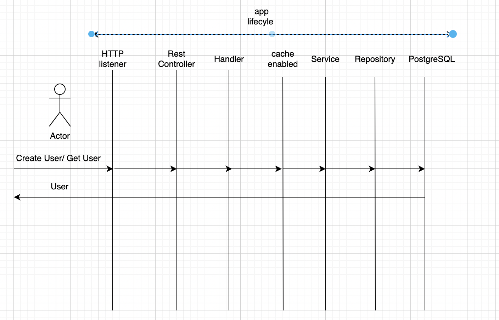

# user-account

## Description
User-account is a simple user account management system. It is a RESTful API that allows users to create users, get user by ID.

## Installation
1. Clone the repository
2. Run `docker-compose up -d --build`
3. Run `make database-migrate-up`
4. Run `go run cmd/server/main.go`

## Usage
1. Create a user
```
curl -X POST http://localhost:8000/users/ -H "Content-Type: application/json" -d '{"name": "YourUserName"}'
```
2. Get a user by ID
```
curl -X GET http://localhost:8000/users/{userID}
```

## Testing
1. Run `make test`

## Code structure
### cmd directory
The cmd directory is commonly used in Go projects to represent the entry points of the application,
This is particularly useful in the case of larger systems like microservices where you might have multiple services within the same git repository.
Currently, we have server (running http server) and command (command line interface - currently only for migration up command) in this directory.
cmd
```
├── command
    ├── internal
        ├── database
            ├── database.go
            ├── migrate.go
        ├── config.go
    ├── main.go
├── server
    ├── deployment
    ├── docs
        ├── docs.go
        ├── swagger.json
        ├── swagger.yaml
    ├── internal
        ├── routers
            ├── router.go
        ├── app.go
        ├── config.go
    ├── main.go
```
### common directory
The common directory is used to store common code that is used across the application.
It contains the following packages:
- app - application container for lifecycle of the application, executing tasks, and running the application
- cache - cache interface and implementation
- config - configuration interface and implementation
- environment - environment interface and implementation
- errors - currently only one error, but in future we should have error interface and implementation with error fields
- log - log interface and implementation using zap
- ptr - pointer helper
- server - http server interface and implementation
- storage - it contains postgres interface and implementation, in future we could have storage type, so we can have factory for creating storage 

### migration directory
The migration directory is used to store database migration files.

### monitoring directory
The monitoring directory is used to store monitoring code, currently only prometheus metrics.

### pkg directory
The pkg directory is used to store code that is used across the application
It contains the following packages:
 - user pkg - user package contains user api, cache, domain, repository, service

### Config
Data for local configuration is placed in config.local.yaml file.
Data for production configuration is placed in config.prod.yaml file. Currently empty.
Data for canary configuration is placed in config.canary.yaml file. Currently empty.

### Diagram

### Database
Postgres database is used for storing user data.

### Cache
Redis cache is used for storing user data.

### Monitoring
Prometheus is used for monitoring.

### Logging
Zap is used for logging.

### Future work
- Add more tests
- Add open telemetry for tracing
- Add more metrics
- Add audit logging for requests, it will be audit log service, which will be used for audit logging in no sql database like clickhouse
- Server should become api gateway
- User CRUD operations should be moved to user service

## Improvements
- errors package should have error interface and implementation with error fields, its sugared error
- delivery package should have rest package, grpc package, websocket package
- storage package should have factory for creating storage
- cache package should have factory for creating cache (in memory cache, distributed cache, replicated cache), also we should have different eviction strategies like LRU, LFU, FIFO
